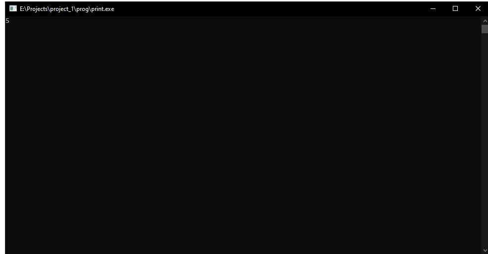

# First repository on Github

Hello everyone. This is simple bimble prog.

I'am use mingw.

To compile enter:
```sh
gcc -c func.c -o func.o
gcc -c main.c -o main.o
gcc func.o main.o -o bin/print.exe
```

If you have a problem, func.h need to paste to all files at head…

# <3

